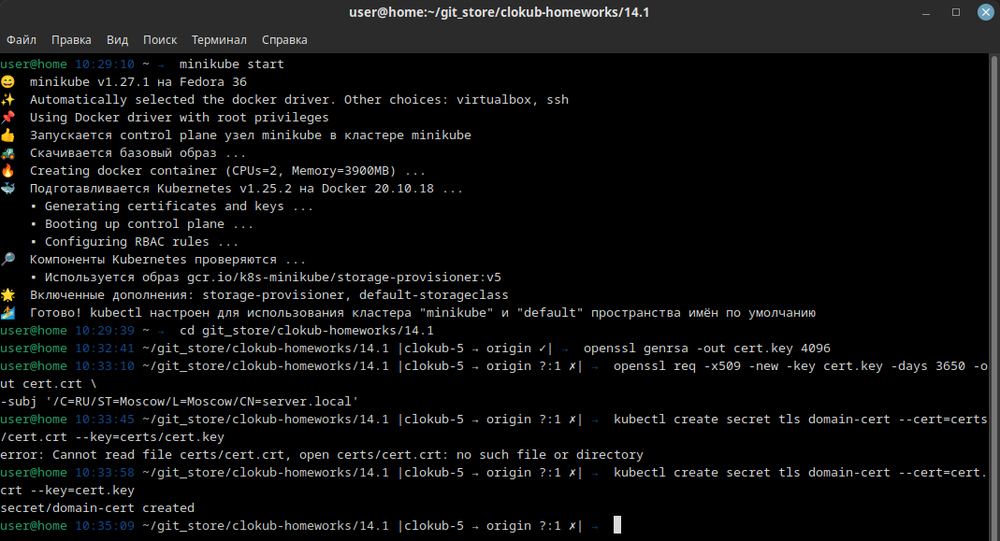
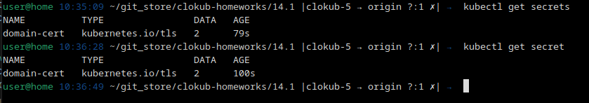
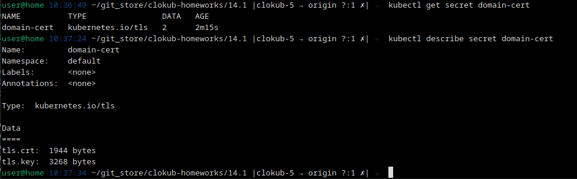
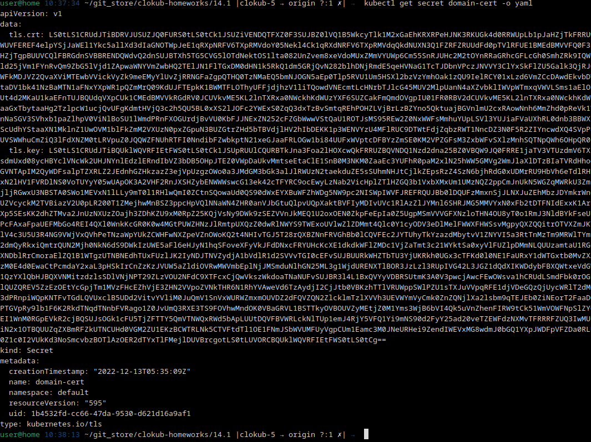
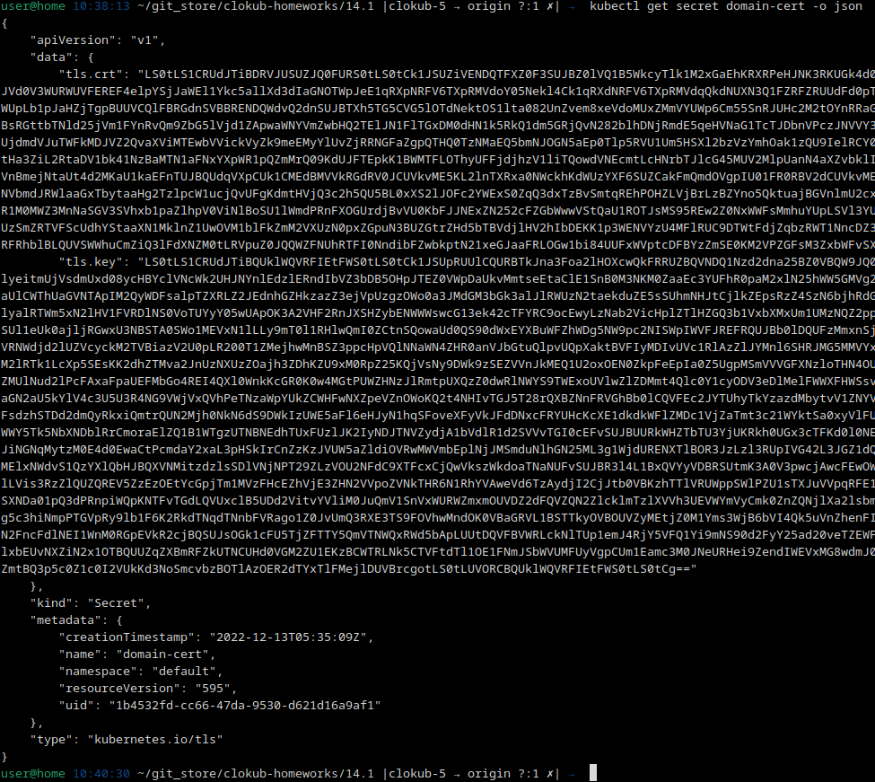
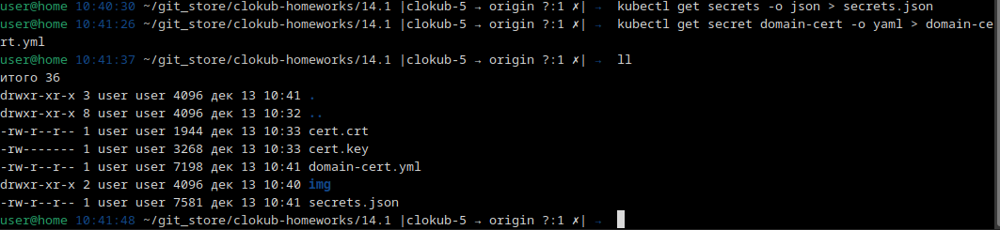
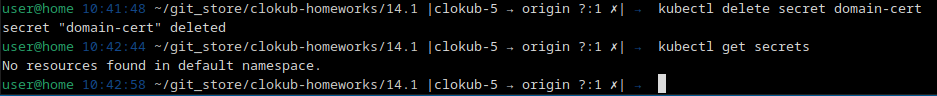
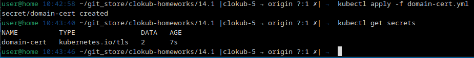
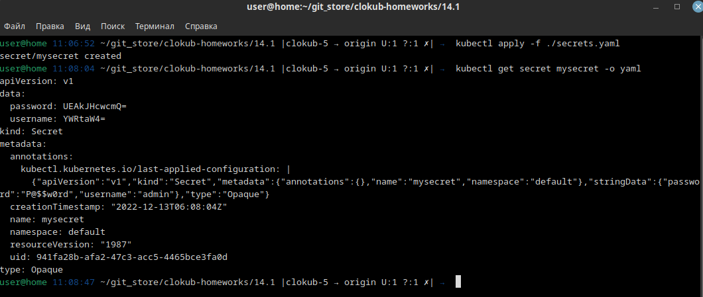
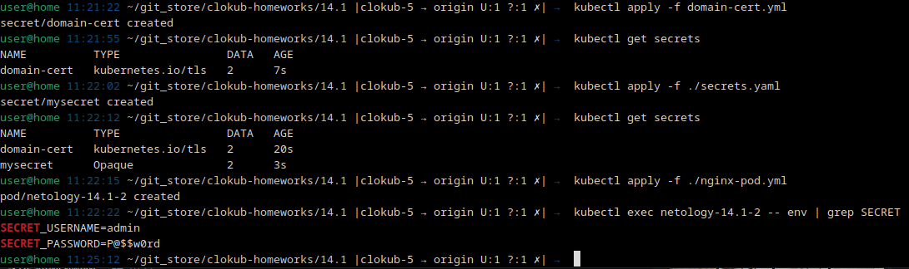

# Домашнее задание к занятию "14.1 Создание и использование секретов"

## Задача 1: Работа с секретами через утилиту kubectl в установленном minikube

Выполните приведённые ниже команды в консоли, получите вывод команд. Сохраните
задачу 1 как справочный материал.

### Как создать секрет?

```
openssl genrsa -out cert.key 4096
openssl req -x509 -new -key cert.key -days 3650 -out cert.crt \
-subj '/C=RU/ST=Moscow/L=Moscow/CN=server.local'
kubectl create secret tls domain-cert --cert=certs/cert.crt --key=certs/cert.key
```



### Как просмотреть список секретов?

```
kubectl get secrets
kubectl get secret
```



### Как просмотреть секрет?

```
kubectl get secret domain-cert
kubectl describe secret domain-cert
```



### Как получить информацию в формате YAML и/или JSON?

```
kubectl get secret domain-cert -o yaml
kubectl get secret domain-cert -o json
```




### Как выгрузить секрет и сохранить его в файл?

```
kubectl get secrets -o json > secrets.json
kubectl get secret domain-cert -o yaml > domain-cert.yml
```



### Как удалить секрет?

```
kubectl delete secret domain-cert
```



### Как загрузить секрет из файла?

```
kubectl apply -f domain-cert.yml
```



## Задача 2 (*): Работа с секретами внутри модуля

Выберите любимый образ контейнера, подключите секреты и проверьте их доступность
как в виде переменных окружения, так и в виде примонтированного тома.

Создадим фаил с секретами secrets.yaml и применим

```
user@home 11:06:52 ~/git_store/clokub-homeworks/14.1 |clokub-5 → origin U:1 ?:1 ✗| →  kubectl apply -f ./secrets.yaml
secret/mysecret created
user@home 11:08:04 ~/git_store/clokub-homeworks/14.1 |clokub-5 → origin U:1 ?:1 ✗| →  kubectl get secret mysecret -o yaml
apiVersion: v1
data:
  password: UEAkJHcwcmQ=
  username: YWRtaW4=
kind: Secret
metadata:
  annotations:
    kubectl.kubernetes.io/last-applied-configuration: |
      {"apiVersion":"v1","kind":"Secret","metadata":{"annotations":{},"name":"mysecret","namespace":"default"},"stringData":{"password":"P@$$w0rd","username":"admin"},"type":"Opaque"}
  creationTimestamp: "2022-12-13T06:08:04Z"
  name: mysecret
  namespace: default
  resourceVersion: "1987"
  uid: 941fa28b-afa2-47c3-acc5-4465bce3fa0d
type: Opaque
user@home 11:08:47 ~/git_store/clokub-homeworks/14.1 |clokub-5 → origin U:1 ?:1 ✗| →  
```



Для контейнера взял пример из презентации, nginx, настроил в нём:

```
user@home 11:21:22 ~/git_store/clokub-homeworks/14.1 |clokub-5 → origin U:1 ?:1 ✗| →  kubectl apply -f domain-cert.yml
secret/domain-cert created
user@home 11:21:55 ~/git_store/clokub-homeworks/14.1 |clokub-5 → origin U:1 ?:1 ✗| →  kubectl get secrets
NAME          TYPE                DATA   AGE
domain-cert   kubernetes.io/tls   2      7s
user@home 11:22:02 ~/git_store/clokub-homeworks/14.1 |clokub-5 → origin U:1 ?:1 ✗| →  kubectl apply -f ./secrets.yaml
secret/mysecret created
user@home 11:22:12 ~/git_store/clokub-homeworks/14.1 |clokub-5 → origin U:1 ?:1 ✗| →  kubectl get secrets
NAME          TYPE                DATA   AGE
domain-cert   kubernetes.io/tls   2      20s
mysecret      Opaque              2      3s
user@home 11:22:15 ~/git_store/clokub-homeworks/14.1 |clokub-5 → origin U:1 ?:1 ✗| →  kubectl apply -f ./nginx-pod.yml 
pod/netology-14.1-2 created
user@home 11:22:22 ~/git_store/clokub-homeworks/14.1 |clokub-5 → origin U:1 ?:1 ✗| →  kubectl exec netology-14.1-2 -- env | grep SECRET
SECRET_USERNAME=admin
SECRET_PASSWORD=P@$$w0rd
user@home 11:25:12 ~/git_store/clokub-homeworks/14.1 |clokub-5 → origin U:1 ?:1 ✗| →  
```

