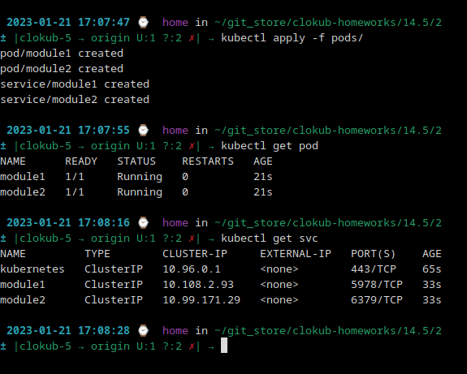
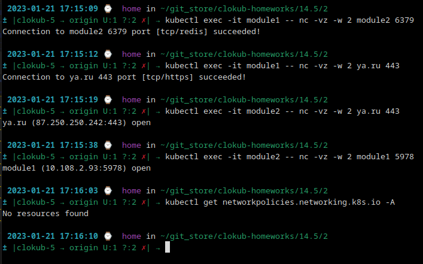
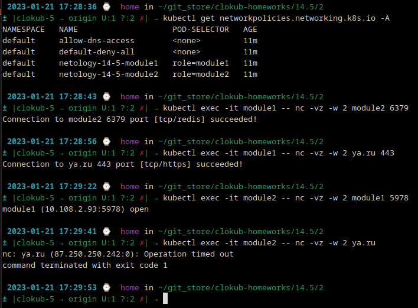

# Домашнее задание к занятию "14.5 SecurityContext, NetworkPolicies"

## Задача 1: Рассмотрите пример 14.5/example-security-context.yml

Создайте модуль

```
kubectl apply -f 14.5/example-security-context.yml
```

Проверьте установленные настройки внутри контейнера

```
kubectl logs security-context-demo
uid=1000 gid=3000 groups=3000
```


## Задача 2 (*): Рассмотрите пример 14.5/example-network-policy.yml

Создайте два модуля. Для первого модуля разрешите доступ к внешнему миру
и ко второму контейнеру. Для второго модуля разрешите связь только с
первым контейнером. Проверьте корректность настроек.

Манифесты:

1. Поды и сервисы:
    * [00-pod-module1.yml](./14.5/2/00-pod-module1.yml)
    * [00-pod-module2.yml](./14.5/2/00-pod-module2.yml)
    * [10-svc-module1.yml](./14.5/2/10-svc-module1.yml)
    * [10-svc-module2.yml](./14.5/2/10-svc-module2.yml)
1. Сетевые политики:
    * [20-np-default.yml](./14.5/2/20-np-default.yml) - политика по-умолчанию, всё запретить
    * [21-np-dns.yml](./14.5/2/21-np-dns.yml) - доступ для всех подов к CoreDNS Кубернетиса, чтобы поды могли обращаться друг к другу по хостнеймам
    * [22-np-module1.yml](./14.5/2/22-np-module1.yml) - политика для первого модуля согласно задания
    * [22-np-module2.yml](./14.5/2/22-np-module2.yml) - политика для второго модуля согласно задания

Проверка:

1. Создаю поды и сервисы



1. Проверяю, что у обоих модулей есть доступ друг к другу и в интернет. Первой командой убеждаюсь, что сетевые политики не настроены



1. Применяю сетевые политики


1. Проверяю, что сетевые политики настроены, потом проверяю результат: у первого пода есть доступ ко второму и в интернет, а у второго только к первому


