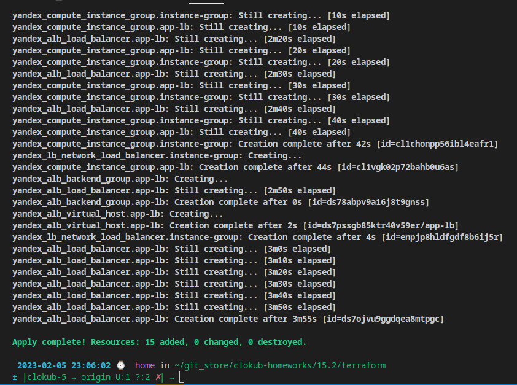
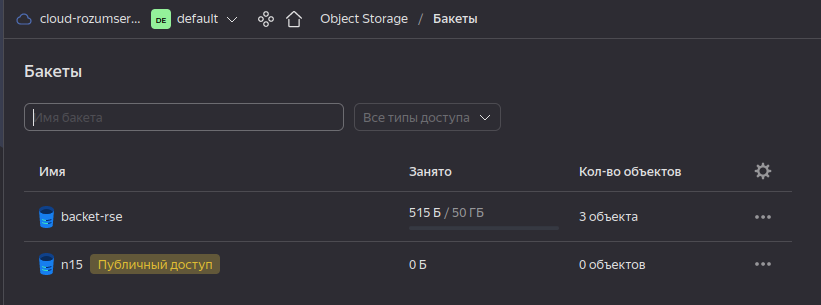
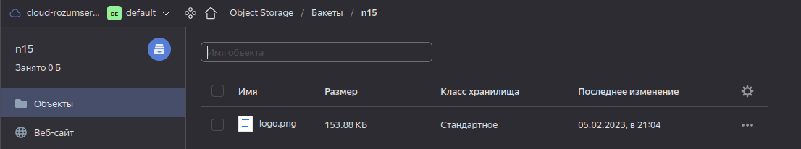
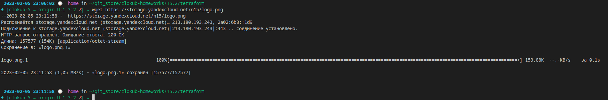
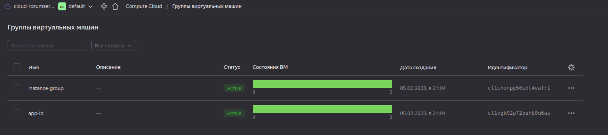
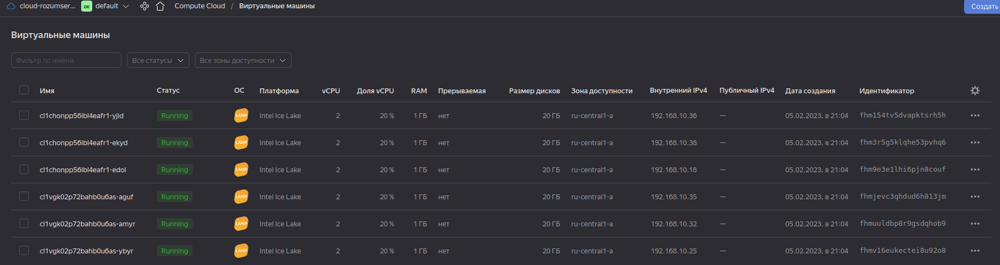
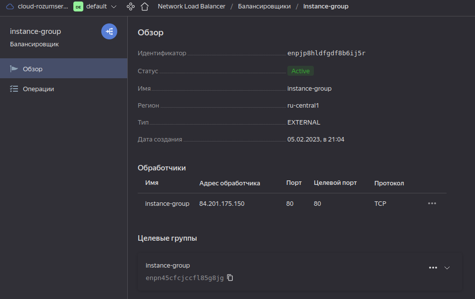
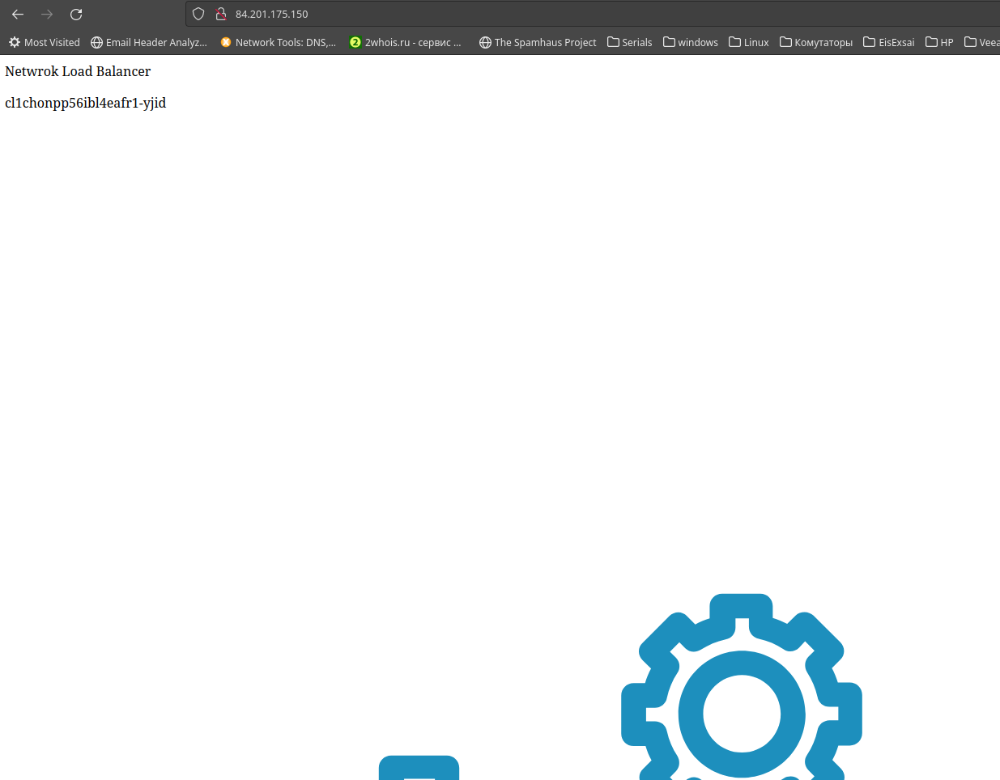
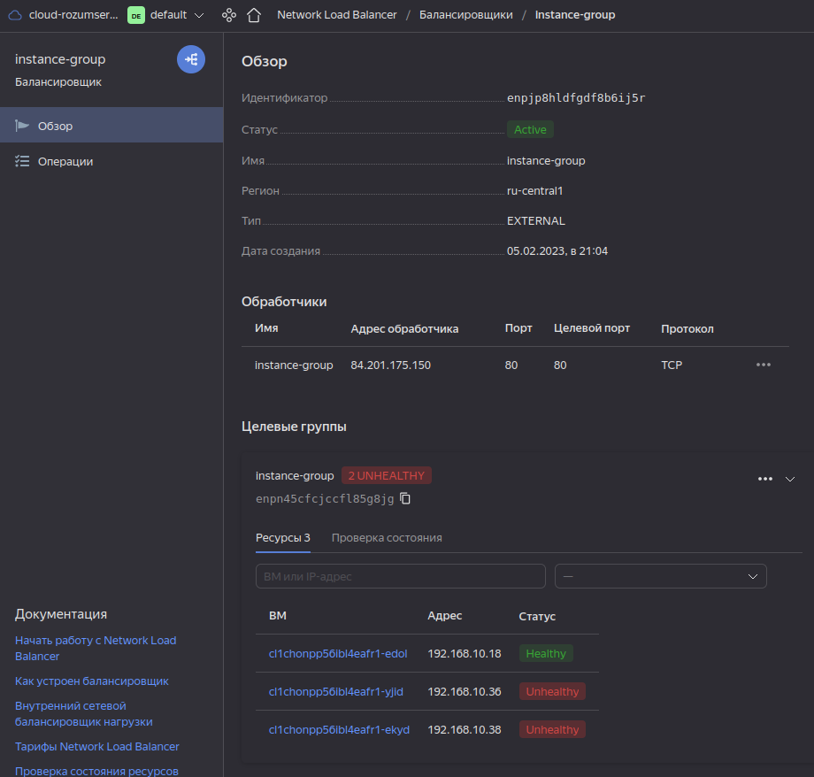
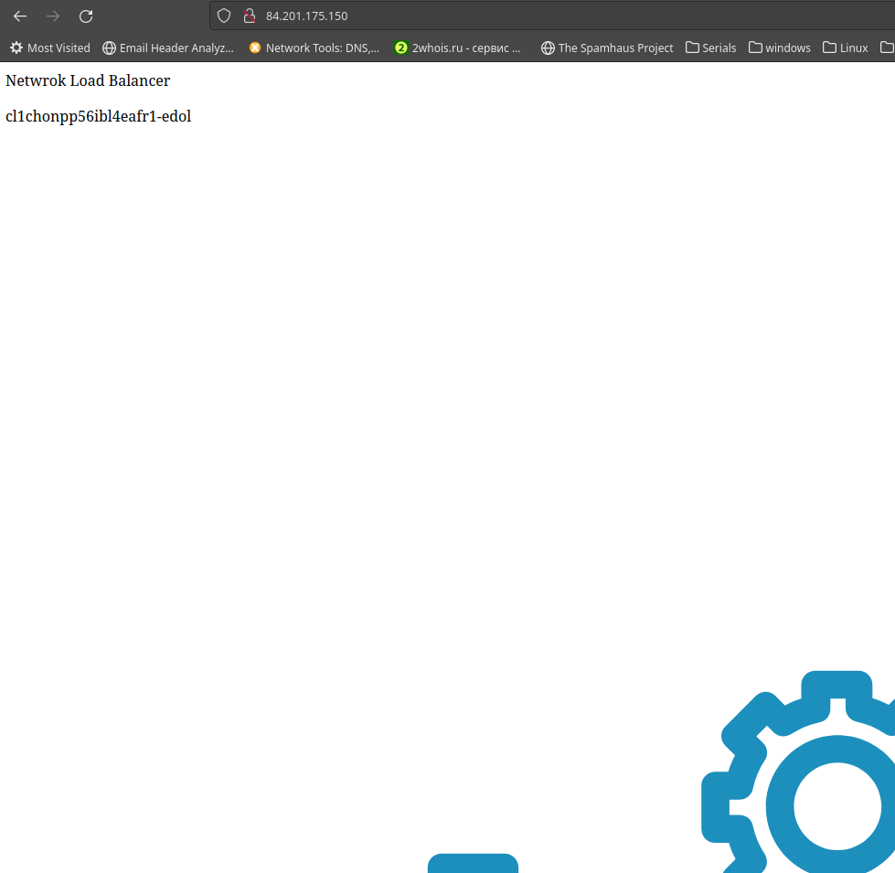

# Домашнее задание к занятию 15.2 "Вычислительные мощности. Балансировщики нагрузки"

Домашнее задание будет состоять из обязательной части, которую необходимо выполнить на провайдере Яндекс.Облако, и дополнительной части в AWS (можно выполнить по желанию). Все домашние задания в 15 блоке связаны друг с другом и в конце представляют пример законченной инфраструктуры.
Все задания требуется выполнить с помощью Terraform, результатом выполненного домашнего задания будет код в репозитории. Перед началом работ следует настроить доступ до облачных ресурсов из Terraform, используя материалы прошлых лекций и ДЗ.

---

## Задание 1. Яндекс.Облако (обязательное к выполнению)

1. Создать bucket Object Storage и разместить там файл с картинкой:

- Создать bucket в Object Storage с произвольным именем (например, _имя_студента_дата_);
- Положить в bucket файл с картинкой;
- Сделать файл доступным из Интернет.

2. Создать группу ВМ в public подсети фиксированного размера с шаблоном LAMP и web-страничкой, содержащей ссылку на картинку из bucket:

- Создать Instance Group с 3 ВМ и шаблоном LAMP. Для LAMP рекомендуется использовать `image_id = fd827b91d99psvq5fjit`;
- Для создания стартовой веб-страницы рекомендуется использовать раздел `user_data` в [meta_data](https://cloud.yandex.ru/docs/compute/concepts/vm-metadata);
- Разместить в стартовой веб-странице шаблонной ВМ ссылку на картинку из bucket;
- Настроить проверку состояния ВМ.

3. Подключить группу к сетевому балансировщику:

- Создать сетевой балансировщик;
- Проверить работоспособность, удалив одну или несколько ВМ.

4. *Создать Application Load Balancer с использованием Instance group и проверкой состояния.

Документация

- [Compute instance group](https://registry.terraform.io/providers/yandex-cloud/yandex/latest/docs/resources/compute_instance_group)
- [Network Load Balancer](https://registry.terraform.io/providers/yandex-cloud/yandex/latest/docs/resources/lb_network_load_balancer)
- [Группа ВМ с сетевым балансировщиком](https://cloud.yandex.ru/docs/compute/operations/instance-groups/create-with-balancer)

---

Файлы Terraform:

- [security.tf](./15.2/terraform/security.tf) - настройка Service Account, это обязательно для работы с Object Storage и Instange Group через Terraform
- [backet.tf](./15.2/terraform/backet.tf) - Bucket и файл
- [network.tf](./15.2/terraform/network.tf) - сеть и подсеть
- [main.tf](./15.2/terraform/main.tf) - группы инстансов, одна для Application, одна для Network Load Balancer
- [loadbalancers.tf](./15.2/terraform/loadbalancers.tf) - балансировщики нагрузки, Appication и Network.

1. Применяю конфиг Terraform

Создан бакет `n15`

Создан файл `logo.png`

Проверяю, что файл свободно доступен из интернета

1. Созданы две инстанс группы по шаблону LAMP

Созданные инстансы

### Network Load Balancer

1. Создан сетевой балансировщик, к нему подключена одна группа

Проверяю, что страничка загружается

1. Остановил поочерёдно два инстанса из трёх

Страничка продолжает работать, отправляя трафик только на один хост

### Application Load Balancer

1. Создан Application Load Balancer с использованием Instance group и проверкой состояния.

Роутер

Бекенд

Таргет группа с тремя инстансами

Проверяю, что страничка доступна

1. Отключаю две ноды

Через какое-то время начинает работать нормально.

