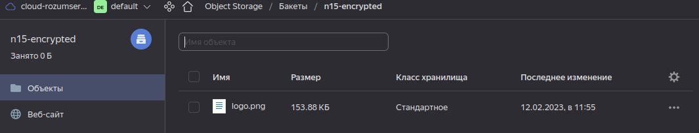
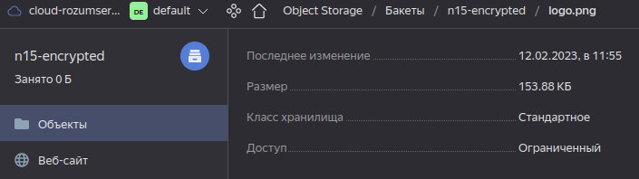

# Домашнее задание к занятию 15.3 "Безопасность в облачных провайдерах"

Используя конфигурации, выполненные в рамках предыдущих домашних заданиях, нужно добавить возможность шифрования бакета.

---

## Задание 1. Яндекс.Облако (обязательное к выполнению)

1. С помощью ключа в KMS необходимо зашифровать содержимое бакета:

- Создать ключ в KMS,
- С помощью ключа зашифровать содержимое бакета, созданного ранее.

Судя по [руководству](https://cloud.yandex.ru/docs/storage/concepts/hosting) бакету необходим публичный доступ. Создал два бакета: для шифрованных данных и не шифрованных.

Судя по [руководству](https://cloud.yandex.ru/docs/storage/tutorials/server-side-encryption) шифроваться будут только новые объекты, бакет и объект созданы заново.

Манифесты:
- [provider.tf](./15.3/yandex/provider.tf) - провайдер и его настройка
- [variables.tf](./15.3/yandex/variables.tf) - переменные
- [serviceaccount.tf](./15.3/yandex/serviceaccount.tf) - сервис аккаунт, он необходим чтобы работать с Object Storage через Terraform
- [storage.tf](./15.3/yandex/storage.tf) - бакеты и объекты в Object Storage, интеграция с KMS
- [kms.tf](./15.3/yandex/kms.tf) - ключ KMS

1. Применяю манифест

1. Ключ добавлен

1. Добавлены бакеты

1. Для бакета `n15-encrypted` настроено шифрование

1. В бакете один файл, по общему описанию непонятно, он зашифрован или нет

1. Если "провалиться" в файл, то там будут те же данные, что в таблице в общем списке, и непонятно зашифрован объёкт или нет.

1. (Выполняется НЕ в terraform) *Создать статический сайт в Object Storage c собственным публичным адресом и сделать доступным по HTTPS

- Создать сертификат,
- Создать статическую страницу в Object Storage и применить сертификат HTTPS,
- В качестве результата предоставить скриншот на страницу с сертификатом в заголовке ("замочек").

У меня уже был домен, поэтому я воспользовался [этой инструкцией](https://cloud.yandex.ru/docs/storage/operations/hosting/own-domain).

1. Загрузил сертификат

1. Настройл HTTPS

1. Настроил хостинг для статики

1. Файлы были загружены тераформом в первой части задания

1. По инструкции, настроил CNAME запись в DNS домена, ссылающуюся на бакет в Яндексе

1. Проверил, что страница загружается и защищена сертификатом.

Документация

- [Настройка HTTPS статичного сайта](https://cloud.yandex.ru/docs/storage/operations/hosting/certificate)
- [Object storage bucket](https://registry.terraform.io/providers/yandex-cloud/yandex/latest/docs/resources/storage_bucket)
- [KMS key](https://registry.terraform.io/providers/yandex-cloud/yandex/latest/docs/resources/kms_symmetric_key)

