# Домашнее задание к занятию 15.4 "Кластеры. Ресурсы под управлением облачных провайдеров"

Организация кластера Kubernetes и кластера баз данных MySQL в отказоустойчивой архитектуре.
Размещение в private подсетях кластера БД, а в public - кластера Kubernetes.

---

## Задание 1. Яндекс.Облако (обязательное к выполнению)

- [version.tf](./15.4/terraform/version.tf) - подключение и настройки провайдера
- [network.tf](./15.4/terraform/network.tf) - сеть
- [k8s.tf](./15.4/terraform/k8s.tf) - KMS ключ
- [security.tf](./15.4/terraform/security.tf) - сервис-аккаунт
- [mysql.tf](./15.4/terraform/mysql.tf) - кластер MySQL, ДБ и пользователь базы
- [kms.tf](./15.4/terraform/kms.tf) - кластер Kubernetes и группа узлов

Применяю манифест:
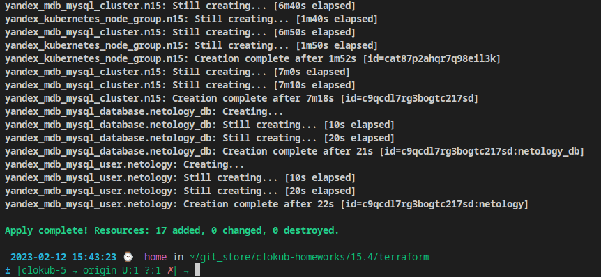

> 1. Настроить с помощью Terraform кластер баз данных MySQL:
>       - Используя настройки VPC с предыдущих ДЗ, добавить дополнительно подсеть private в разных зонах, чтобы обеспечить отказоустойчивость 
>       - Разместить ноды кластера MySQL в разных подсетях
>       - Необходимо предусмотреть репликацию с произвольным временем технического обслуживания
>       - Использовать окружение PRESTABLE, платформу Intel Broadwell с производительностью 50% CPU и размером диска 20 Гб
>       - Задать время начала резервного копирования - 23:59
>       - Включить защиту кластера от непреднамеренного удаления
>       - Создать БД с именем `netology_db` c логином и паролем

1. Подсети

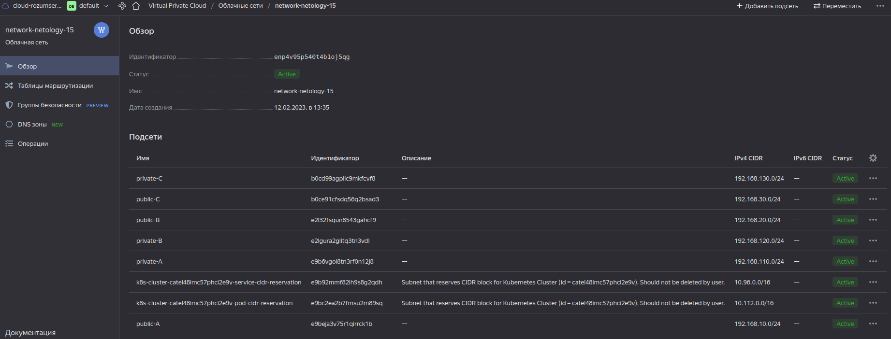

1. Кластер MySQL

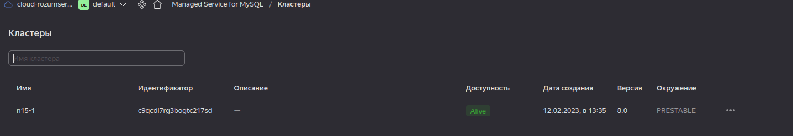

1. Параметры кластера. Окружение PRESTABLE.

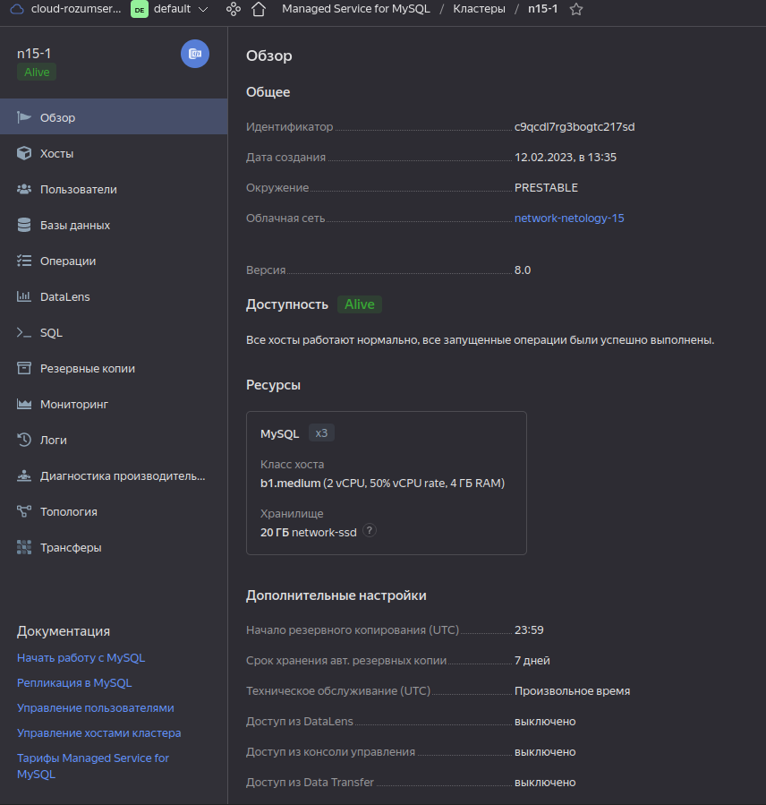

Настроено техническое обслуживание в произвольное время и резервное копирование в 23:59. Используется платформа Intel Broadwell с производительностью 50% CPU и размером диска 20 Гб. Включена защита от удаления

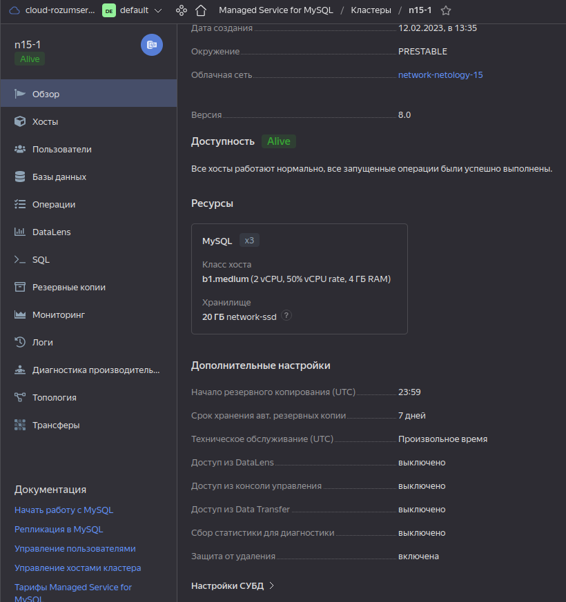

1. Хосты кластера, в разных подсетях.

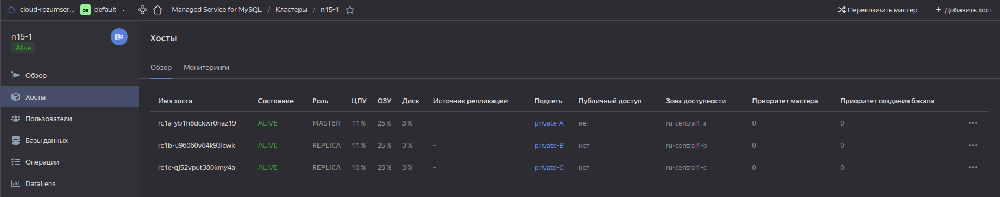

1. Отдельный пользователь `netology`

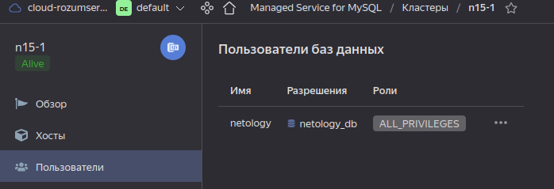

1. База `netology_db`

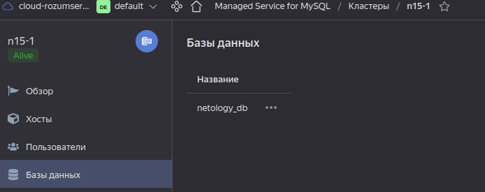

> 2. Настроить с помощью Terraform кластер Kubernetes
>       - Используя настройки VPC с предыдущих ДЗ, добавить дополнительно 2 подсети public в разных зонах, чтобы обеспечить отказоустойчивость
>       - Создать отдельный сервис-аккаунт с необходимыми правами 
>       - Создать региональный мастер kubernetes с размещением нод в разных 3 подсетях
>       - Добавить возможность шифрования ключом из KMS, созданного в предыдущем ДЗ
>       - Создать группу узлов состояющую из 3 машин с автомасштабированием до 6
>       - Подключиться к кластеру с помощью `kubectl`
>       - *Запустить микросервис phpmyadmin и подключиться к БД, созданной ранее
>       - *Создать сервис типы Load Balancer и подключиться к phpmyadmin. Предоставить скриншот с публичным адресом и подключением к БД
> 

Выполнить задание в точности не получилось, т.к. Яндекс позволяет создать группу нод с автоскейлом только в одной подсети:

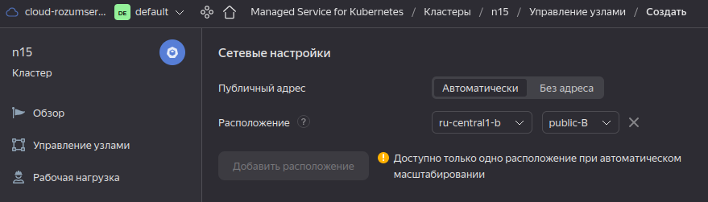

В остальном всё удалось:
1. Сервис-аккаунт

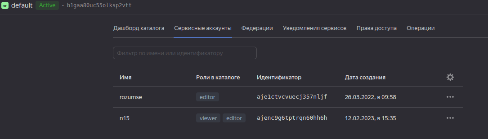

1. KMS ключ

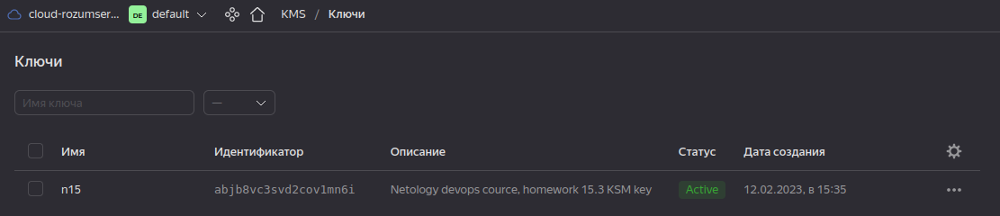

1. Параметры кластера, сервис-аккаунт и ключ KMS используются

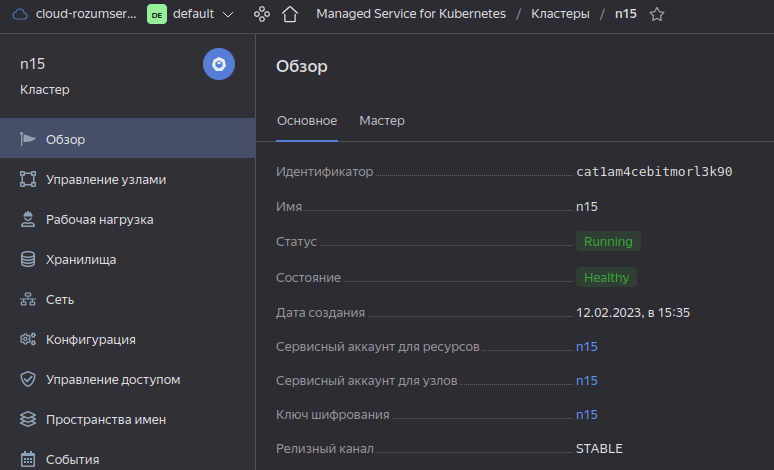

Мастер - региональный. 

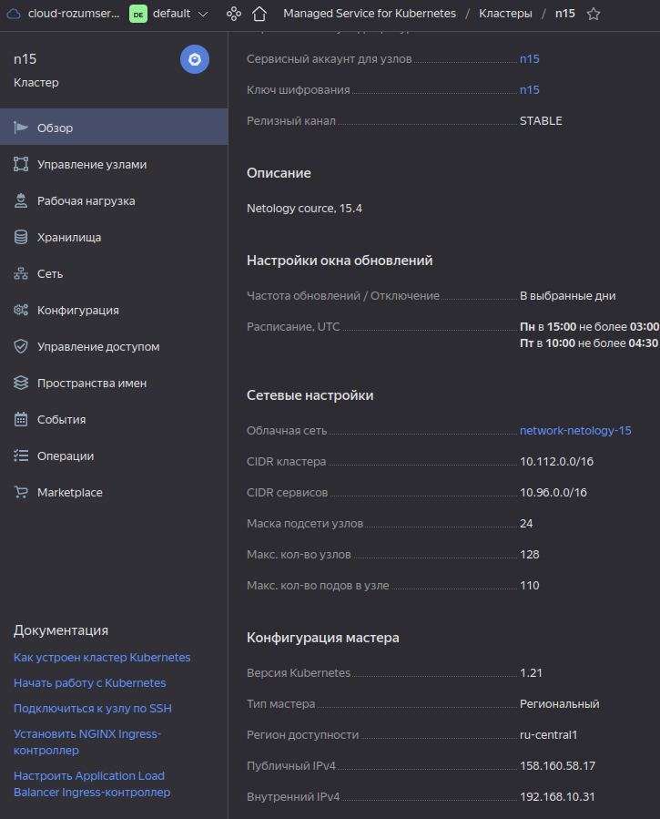

1. Группа нод с автоскейлом от 3 до 6

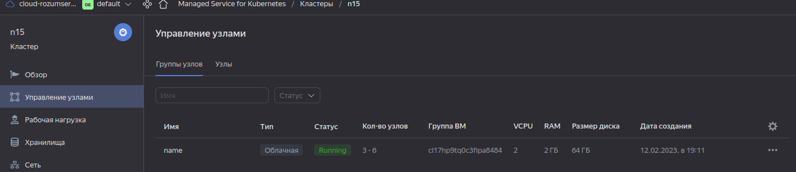

1. Ноды

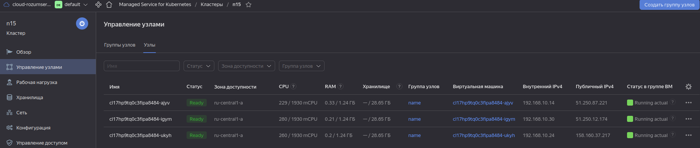

1. По [документации](https://cloud.yandex.ru/docs/managed-kubernetes/operations/connect/#kubectl-connect) подключаюсь к кластеру с `kubectl`

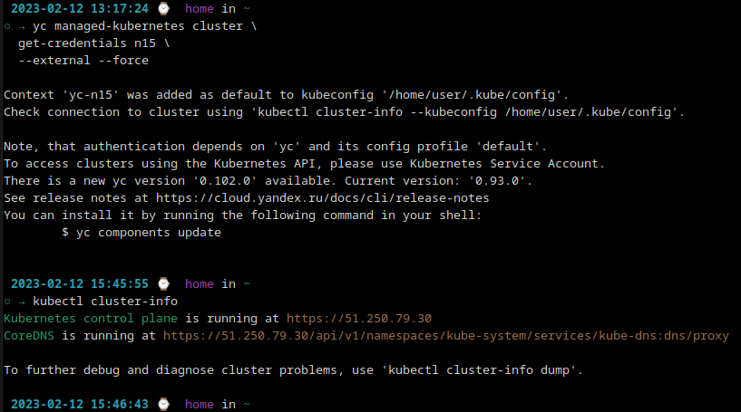

1. Применяю [манифесты](./15.4/terraform/manifests/) `phpMyAdmin`:

    - [00-deployment.yml](./15.4/terraform/manifests/00-deployment.yml)

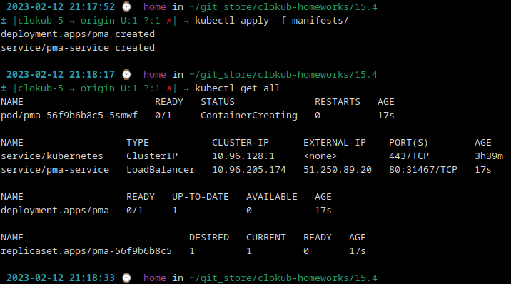

1. Трафик к сервису идёт через балансировщик

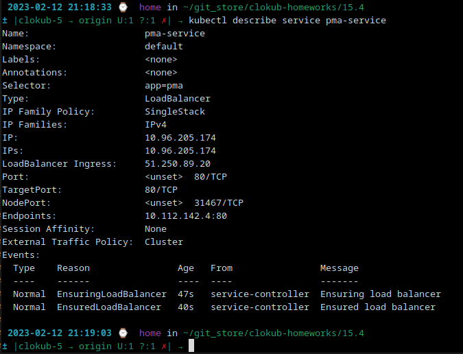

1. Подключаюсь к вебке, в списке видно базу `netology_db`

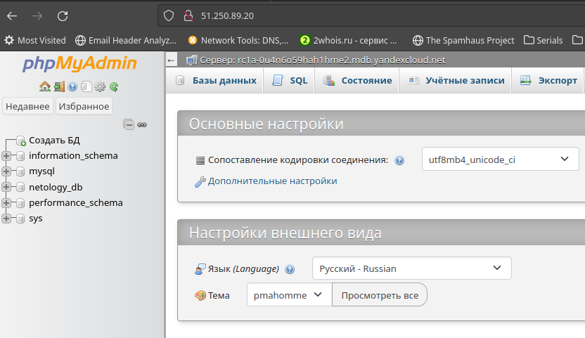

Документация

- [MySQL cluster](https://registry.terraform.io/providers/yandex-cloud/yandex/latest/docs/resources/mdb_mysql_cluster)
- [Создание кластера kubernetes](https://cloud.yandex.ru/docs/managed-kubernetes/operations/kubernetes-cluster/kubernetes-cluster-create)
- [K8S Cluster](https://registry.terraform.io/providers/yandex-cloud/yandex/latest/docs/resources/kubernetes_cluster)
- [K8S node group](https://registry.terraform.io/providers/yandex-cloud/yandex/latest/docs/resources/kubernetes_node_group)

